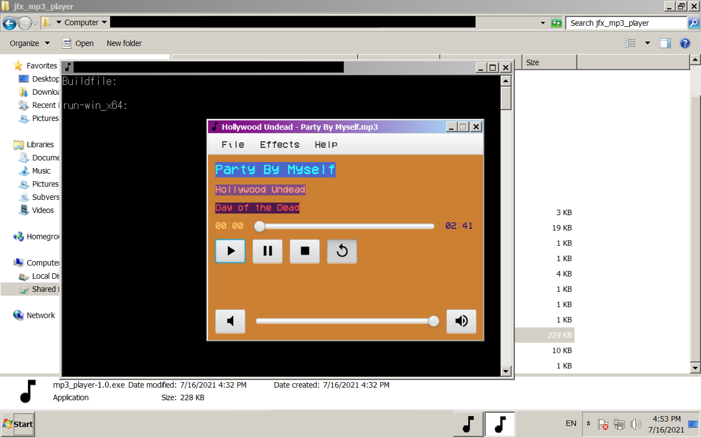
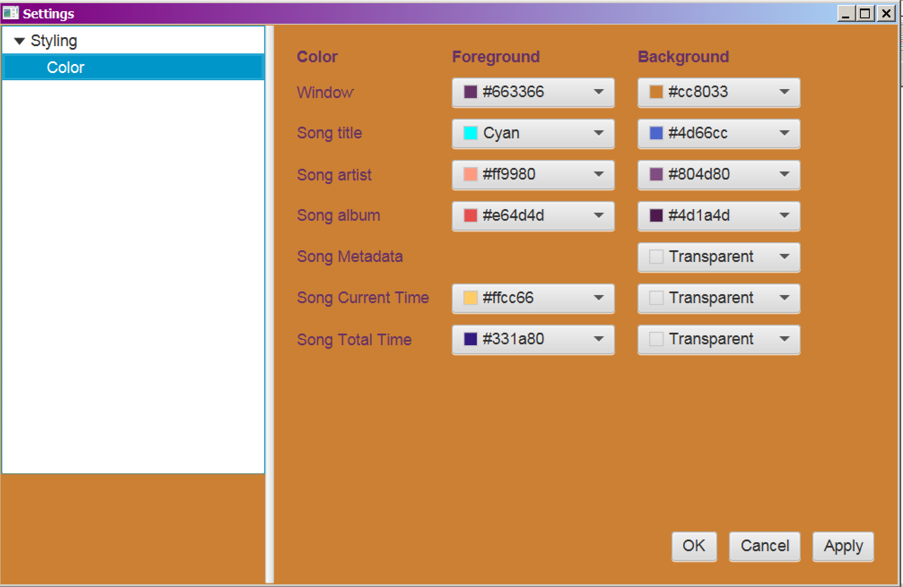
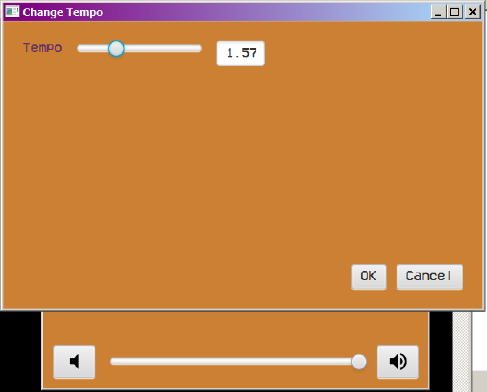
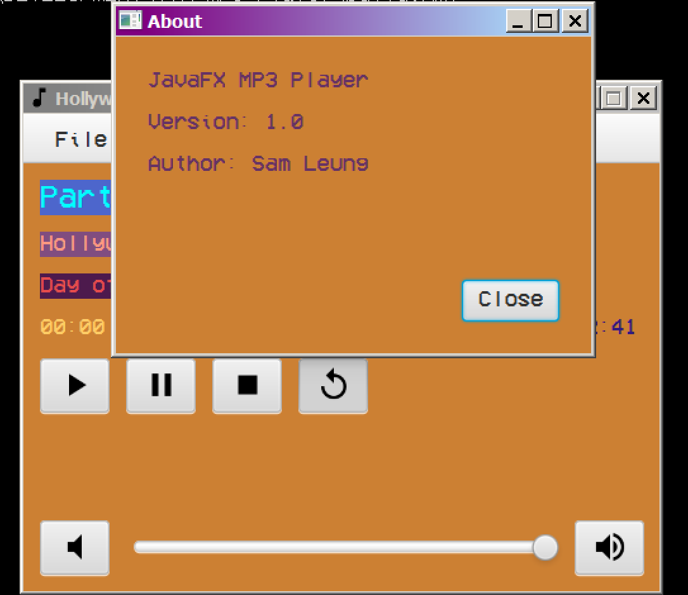
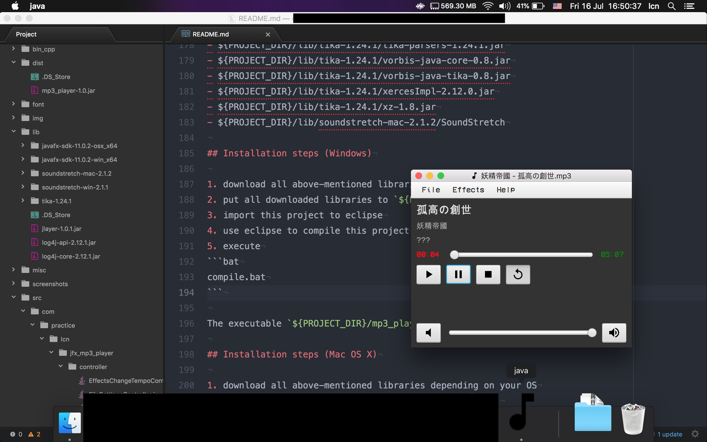

# JavaFX MP3 Player

This project attempts to create a mp3 music player using JavaFX.

## Features

- customizable skin
- able to play mp3 (of course)
- able to apply effects on mp3
    - tempo shift

## Caution

- mp3 will remain unchanged after applying any effect.

## Compatibility

This program is compatible with

- Windows x64
- Mac OS X x64

## Windows Environment

- OpenJDK 11
- JavaFX SDK 11.0.2 (x64)
- Apache Ant 1.9.14
- ${PROJECT_DIR}/lib/jlayer-1.0.1.jar
- ${PROJECT_DIR}/lib/log4j-api-2.12.1.jar
- ${PROJECT_DIR}/lib/log4j-core-2.12.1.jar
- ${PROJECT_DIR}/lib/tika-1.24.1/apache-mime4j-core-0.8.3.jar
- ${PROJECT_DIR}/lib/tika-1.24.1/apache-mime4j-dom-0.8.3.jar
- ${PROJECT_DIR}/lib/tika-1.24.1/asm-8.0.1.jar
- ${PROJECT_DIR}/lib/tika-1.24.1/bcmail-jdk15on-1.65.jar
- ${PROJECT_DIR}/lib/tika-1.24.1/bcprov-jdk15on-1.65.jar
- ${PROJECT_DIR}/lib/tika-1.24.1/boilerpipe-1.1.0.jar
- ${PROJECT_DIR}/lib/tika-1.24.1/c3p0-0.9.5.5.jar
- ${PROJECT_DIR}/lib/tika-1.24.1/cdm-4.5.5.jar
- ${PROJECT_DIR}/lib/tika-1.24.1/commons-codec-1.13.jar
- ${PROJECT_DIR}/lib/tika-1.24.1/commons-compress-1.20.jar
- ${PROJECT_DIR}/lib/tika-1.24.1/commons-csv-1.8.jar
- ${PROJECT_DIR}/lib/tika-1.24.1/commons-exec-1.3.jar
- ${PROJECT_DIR}/lib/tika-1.24.1/commons-io-2.6.jar
- ${PROJECT_DIR}/lib/tika-1.24.1/commons-lang3-3.10.jar
- ${PROJECT_DIR}/lib/tika-1.24.1/cxf-rt-rs-client-3.3.6.jar
- ${PROJECT_DIR}/lib/tika-1.24.1/dec-0.1.2.jar
- ${PROJECT_DIR}/lib/tika-1.24.1/geoapi-3.0.1.jar
- ${PROJECT_DIR}/lib/tika-1.24.1/grib-4.5.5.jar
- ${PROJECT_DIR}/lib/tika-1.24.1/gson-2.8.6.jar
- ${PROJECT_DIR}/lib/tika-1.24.1/guava-28.2-jre.jar
- ${PROJECT_DIR}/lib/tika-1.24.1/httpclient-4.5.12.jar
- ${PROJECT_DIR}/lib/tika-1.24.1/httpmime-4.5.12.jar
- ${PROJECT_DIR}/lib/tika-1.24.1/httpservices-4.5.5.jar
- ${PROJECT_DIR}/lib/tika-1.24.1/isoparser-1.9.41.2.jar
- ${PROJECT_DIR}/lib/tika-1.24.1/jackcess-3.0.1.jar
- ${PROJECT_DIR}/lib/tika-1.24.1/jackcess-encrypt-3.0.0.jar
- ${PROJECT_DIR}/lib/tika-1.24.1/jackson-annotations-2.10.3.jar
- ${PROJECT_DIR}/lib/tika-1.24.1/jackson-core-2.10.3.jar
- ${PROJECT_DIR}/lib/tika-1.24.1/jackson-databind-2.10.3.jar
- ${PROJECT_DIR}/lib/tika-1.24.1/jai-imageio-core-1.4.0.jar
- ${PROJECT_DIR}/lib/tika-1.24.1/jakarta.activation-1.2.1.jar
- ${PROJECT_DIR}/lib/tika-1.24.1/java-libpst-0.9.3.jar
- ${PROJECT_DIR}/lib/tika-1.24.1/jbig2-imageio-3.0.3.jar
- ${PROJECT_DIR}/lib/tika-1.24.1/jcl-over-slf4j-1.7.28.jar
- ${PROJECT_DIR}/lib/tika-1.24.1/jdom2-2.0.6.jar
- ${PROJECT_DIR}/lib/tika-1.24.1/jempbox-1.8.16.jar
- ${PROJECT_DIR}/lib/tika-1.24.1/jhighlight-1.0.3.jar
- ${PROJECT_DIR}/lib/tika-1.24.1/jmatio-1.5.jar
- ${PROJECT_DIR}/lib/tika-1.24.1/jna-5.5.0.jar
- ${PROJECT_DIR}/lib/tika-1.24.1/json-simple-1.1.1.jar
- ${PROJECT_DIR}/lib/tika-1.24.1/jsoup-1.13.1.jar
- ${PROJECT_DIR}/lib/tika-1.24.1/jul-to-slf4j-1.7.28.jar
- ${PROJECT_DIR}/lib/tika-1.24.1/juniversalchardet-1.0.3.jar
- ${PROJECT_DIR}/lib/tika-1.24.1/junrar-4.0.0.jar
- ${PROJECT_DIR}/lib/tika-1.24.1/metadata-extractor-2.13.0.jar
- ${PROJECT_DIR}/lib/tika-1.24.1/netcdf4-4.5.5.jar
- ${PROJECT_DIR}/lib/tika-1.24.1/openjson-1.0.12.jar
- ${PROJECT_DIR}/lib/tika-1.24.1/opennlp-tools-1.9.2.jar
- ${PROJECT_DIR}/lib/tika-1.24.1/parso-2.0.11.jar
- ${PROJECT_DIR}/lib/tika-1.24.1/pdfbox-2.0.19.jar
- ${PROJECT_DIR}/lib/tika-1.24.1/pdfbox-tools-2.0.19.jar
- ${PROJECT_DIR}/lib/tika-1.24.1/poi-4.1.2.jar
- ${PROJECT_DIR}/lib/tika-1.24.1/poi-ooxml-4.1.2.jar
- ${PROJECT_DIR}/lib/tika-1.24.1/poi-scratchpad-4.1.2.jar
- ${PROJECT_DIR}/lib/tika-1.24.1/preflight-2.0.19.jar
- ${PROJECT_DIR}/lib/tika-1.24.1/protobuf-java-3.11.4.jar
- ${PROJECT_DIR}/lib/tika-1.24.1/quartz-2.3.2.jar
- ${PROJECT_DIR}/lib/tika-1.24.1/rome-1.12.2.jar
- ${PROJECT_DIR}/lib/tika-1.24.1/sentiment-analysis-parser-0.1.jar
- ${PROJECT_DIR}/lib/tika-1.24.1/sis-metadata-1.0.jar
- ${PROJECT_DIR}/lib/tika-1.24.1/sis-netcdf-1.0.jar
- ${PROJECT_DIR}/lib/tika-1.24.1/sis-utility-1.0.jar
- ${PROJECT_DIR}/lib/tika-1.24.1/slf4j-api-1.7.28.jar
- ${PROJECT_DIR}/lib/tika-1.24.1/tagsoup-1.2.1.jar
- ${PROJECT_DIR}/lib/tika-1.24.1/tika-core-1.24.1.jar
- ${PROJECT_DIR}/lib/tika-1.24.1/tika-parsers-1.24.1.jar
- ${PROJECT_DIR}/lib/tika-1.24.1/vorbis-java-core-0.8.jar
- ${PROJECT_DIR}/lib/tika-1.24.1/vorbis-java-tika-0.8.jar
- ${PROJECT_DIR}/lib/tika-1.24.1/xercesImpl-2.12.0.jar
- ${PROJECT_DIR}/lib/tika-1.24.1/xz-1.8.jar
- ${PROJECT_DIR}/lib/soundstretch-win-2.1.1/soundstretch.exe
- g++
- make

## Mac OS X Environment

- OpenJDK 11
- JavaFX SDK 11.0.2 (x64)
- Apache Ant 1.10.6
- ${PROJECT_DIR}/lib/jlayer-1.0.1.jar
- ${PROJECT_DIR}/lib/log4j-api-2.12.1.jar
- ${PROJECT_DIR}/lib/log4j-core-2.12.1.jar
- ${PROJECT_DIR}/lib/tika-1.24.1/apache-mime4j-core-0.8.3.jar
- ${PROJECT_DIR}/lib/tika-1.24.1/apache-mime4j-dom-0.8.3.jar
- ${PROJECT_DIR}/lib/tika-1.24.1/asm-8.0.1.jar
- ${PROJECT_DIR}/lib/tika-1.24.1/bcmail-jdk15on-1.65.jar
- ${PROJECT_DIR}/lib/tika-1.24.1/bcprov-jdk15on-1.65.jar
- ${PROJECT_DIR}/lib/tika-1.24.1/boilerpipe-1.1.0.jar
- ${PROJECT_DIR}/lib/tika-1.24.1/c3p0-0.9.5.5.jar
- ${PROJECT_DIR}/lib/tika-1.24.1/cdm-4.5.5.jar
- ${PROJECT_DIR}/lib/tika-1.24.1/commons-codec-1.13.jar
- ${PROJECT_DIR}/lib/tika-1.24.1/commons-compress-1.20.jar
- ${PROJECT_DIR}/lib/tika-1.24.1/commons-csv-1.8.jar
- ${PROJECT_DIR}/lib/tika-1.24.1/commons-exec-1.3.jar
- ${PROJECT_DIR}/lib/tika-1.24.1/commons-io-2.6.jar
- ${PROJECT_DIR}/lib/tika-1.24.1/commons-lang3-3.10.jar
- ${PROJECT_DIR}/lib/tika-1.24.1/cxf-rt-rs-client-3.3.6.jar
- ${PROJECT_DIR}/lib/tika-1.24.1/dec-0.1.2.jar
- ${PROJECT_DIR}/lib/tika-1.24.1/geoapi-3.0.1.jar
- ${PROJECT_DIR}/lib/tika-1.24.1/grib-4.5.5.jar
- ${PROJECT_DIR}/lib/tika-1.24.1/gson-2.8.6.jar
- ${PROJECT_DIR}/lib/tika-1.24.1/guava-28.2-jre.jar
- ${PROJECT_DIR}/lib/tika-1.24.1/httpclient-4.5.12.jar
- ${PROJECT_DIR}/lib/tika-1.24.1/httpmime-4.5.12.jar
- ${PROJECT_DIR}/lib/tika-1.24.1/httpservices-4.5.5.jar
- ${PROJECT_DIR}/lib/tika-1.24.1/isoparser-1.9.41.2.jar
- ${PROJECT_DIR}/lib/tika-1.24.1/jackcess-3.0.1.jar
- ${PROJECT_DIR}/lib/tika-1.24.1/jackcess-encrypt-3.0.0.jar
- ${PROJECT_DIR}/lib/tika-1.24.1/jackson-annotations-2.10.3.jar
- ${PROJECT_DIR}/lib/tika-1.24.1/jackson-core-2.10.3.jar
- ${PROJECT_DIR}/lib/tika-1.24.1/jackson-databind-2.10.3.jar
- ${PROJECT_DIR}/lib/tika-1.24.1/jai-imageio-core-1.4.0.jar
- ${PROJECT_DIR}/lib/tika-1.24.1/jakarta.activation-1.2.1.jar
- ${PROJECT_DIR}/lib/tika-1.24.1/java-libpst-0.9.3.jar
- ${PROJECT_DIR}/lib/tika-1.24.1/jbig2-imageio-3.0.3.jar
- ${PROJECT_DIR}/lib/tika-1.24.1/jcl-over-slf4j-1.7.28.jar
- ${PROJECT_DIR}/lib/tika-1.24.1/jdom2-2.0.6.jar
- ${PROJECT_DIR}/lib/tika-1.24.1/jempbox-1.8.16.jar
- ${PROJECT_DIR}/lib/tika-1.24.1/jhighlight-1.0.3.jar
- ${PROJECT_DIR}/lib/tika-1.24.1/jmatio-1.5.jar
- ${PROJECT_DIR}/lib/tika-1.24.1/jna-5.5.0.jar
- ${PROJECT_DIR}/lib/tika-1.24.1/json-simple-1.1.1.jar
- ${PROJECT_DIR}/lib/tika-1.24.1/jsoup-1.13.1.jar
- ${PROJECT_DIR}/lib/tika-1.24.1/jul-to-slf4j-1.7.28.jar
- ${PROJECT_DIR}/lib/tika-1.24.1/juniversalchardet-1.0.3.jar
- ${PROJECT_DIR}/lib/tika-1.24.1/junrar-4.0.0.jar
- ${PROJECT_DIR}/lib/tika-1.24.1/metadata-extractor-2.13.0.jar
- ${PROJECT_DIR}/lib/tika-1.24.1/netcdf4-4.5.5.jar
- ${PROJECT_DIR}/lib/tika-1.24.1/openjson-1.0.12.jar
- ${PROJECT_DIR}/lib/tika-1.24.1/opennlp-tools-1.9.2.jar
- ${PROJECT_DIR}/lib/tika-1.24.1/parso-2.0.11.jar
- ${PROJECT_DIR}/lib/tika-1.24.1/pdfbox-2.0.19.jar
- ${PROJECT_DIR}/lib/tika-1.24.1/pdfbox-tools-2.0.19.jar
- ${PROJECT_DIR}/lib/tika-1.24.1/poi-4.1.2.jar
- ${PROJECT_DIR}/lib/tika-1.24.1/poi-ooxml-4.1.2.jar
- ${PROJECT_DIR}/lib/tika-1.24.1/poi-scratchpad-4.1.2.jar
- ${PROJECT_DIR}/lib/tika-1.24.1/preflight-2.0.19.jar
- ${PROJECT_DIR}/lib/tika-1.24.1/protobuf-java-3.11.4.jar
- ${PROJECT_DIR}/lib/tika-1.24.1/quartz-2.3.2.jar
- ${PROJECT_DIR}/lib/tika-1.24.1/rome-1.12.2.jar
- ${PROJECT_DIR}/lib/tika-1.24.1/sentiment-analysis-parser-0.1.jar
- ${PROJECT_DIR}/lib/tika-1.24.1/sis-metadata-1.0.jar
- ${PROJECT_DIR}/lib/tika-1.24.1/sis-netcdf-1.0.jar
- ${PROJECT_DIR}/lib/tika-1.24.1/sis-utility-1.0.jar
- ${PROJECT_DIR}/lib/tika-1.24.1/slf4j-api-1.7.28.jar
- ${PROJECT_DIR}/lib/tika-1.24.1/tagsoup-1.2.1.jar
- ${PROJECT_DIR}/lib/tika-1.24.1/tika-core-1.24.1.jar
- ${PROJECT_DIR}/lib/tika-1.24.1/tika-parsers-1.24.1.jar
- ${PROJECT_DIR}/lib/tika-1.24.1/vorbis-java-core-0.8.jar
- ${PROJECT_DIR}/lib/tika-1.24.1/vorbis-java-tika-0.8.jar
- ${PROJECT_DIR}/lib/tika-1.24.1/xercesImpl-2.12.0.jar
- ${PROJECT_DIR}/lib/tika-1.24.1/xz-1.8.jar
- ${PROJECT_DIR}/lib/soundstretch-mac-2.1.2/SoundStretch

## Installation steps (Windows)

1. download all above-mentioned libraries depending on your OS
2. put all downloaded libraries to `${PROJECT_DIR}/lib`
3. import this project to eclipse
4. use eclipse to compile this project
5. execute
```bat
compile.bat
```

The executable `${PROJECT_DIR}/mp3_player-${version}.exe` should be generated.

## Installation steps (Mac OS X)

1. download all above-mentioned libraries depending on your OS
2. put all downloaded libraries to `${PROJECT_DIR}/lib`
3. import this project to eclipse
4. use eclipse to compile this project
5. double click `${PROJECT_DIR}/make_desktop_shortcut_osx.command` to create desktop shortcut for the mp3 player
6. double click `${DESKTOP_DIR}/mp3_player-${version}.command` to launch the mp3 player

## Screenshots

Windows









Mac OS X



## License

This application is under GPL v3.0 license. Feel free to modify and add more features to the application. If you use this application for production, please credit my work. Thanks.
